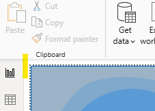
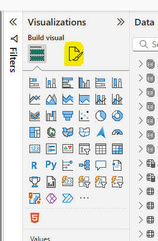
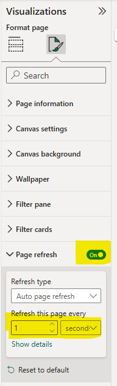

# Vehicle Telemetry Analytics – Power BI Semantic Model 
- v1.0 (Work in progress)

## Overview

The Vehicle Telemetry Analytics solution provides a comprehensive, production-grade semantic model and reporting suite in Power BI for ingesting, analyzing, and visualizing both real-time and historical vehicle data. It is purpose-built for automotive, fleet management, transportation, and mobility service providers who require deep insight into vehicle health, driver behavior, performance metrics, and maintenance operations.

This model is designed using a star schema architecture that aligns with industry best practices and enables scalable, performant analytics across large volumes of streaming and batch telemetry data.

## Features

### Telemetry Monitoring

* Real-time ingestion of telemetry data including:

  * Speed, RPM, fuel level, tire pressure, battery voltage, odometer
  * Engine temperature, oil pressure, acceleration (G-force), and diagnostic signals

### Driver Behavior Analysis

* Insight into:

  * Acceleration and braking habits
  * Harsh events and safety alerts
  * Trip summaries and satisfaction scores
  * Time of day and duration patterns

### Vehicle Health & Maintenance

* Monitor vehicle health KPIs:

  * Oil quality, battery level, brake wear, engine load
  * Health score trends
* Track service history:

  * Scheduled and unscheduled maintenance
  * Technicians and service centers
  * Diagnostic codes and resolutions

### Trip & Route Analysis

* Summary analytics of trips by:

  * Driver, vehicle, purpose, fuel type
  * Distance, fuel consumption, speed
* Geospatial analysis:

  * Live GPS tracking of vehicle routes
  * Route playback visualization

### Alerts and Compliance

* Detection and classification of:

  * Alert types and severity
  * Rule violations or service warnings
  * Diagnostic and regulatory events

## Data Model Design

This Power BI model follows a normalized star schema that separates facts and dimensions. This structure supports high-volume analytics and DirectQuery where needed.

### Dimension Tables

* DimVehicle
* DimDriver
* DimDate
* DimTime
* DimLocation
* DimTelemetrySensor
* DimDiagnosticCode
* DimAlertType
* DimFuelType
* DimDrivingEventType
* DimMaintenanceType
* DimTripPurpose
* DimTechnician
* DimServiceCenter

### Fact Tables

* FactVehicleTelemetry (real-time and batch telemetry streaming)
* FactDrivingBehavior
* FactTripSummary
* FactVehicleHealthSnapshot
* FactAlertEvent
* FactFuelEvent
* FactMaintenanceEvent
* FactServiceVisit
* FactTripGeoStream
* FactVehicleTelemetryStream

## Technical Highlights

* Uses surrogate keys for date/time via DimDate and DimTime
* Applies clustered columnstore indexes on large fact tables
* Incorporates streaming datasets via Power BI REST API or DirectQuery
* Optimized DAX measures for performance and scalability
* Supports both import and hybrid mode deployments

## Deployment Options

* Deploy to Power BI Service via workspace pipeline or Azure DevOps
* Automate ingestion using SQL Server, Azure Synapse, or Event Hubs
* Extend using Python for telemetry simulators (G-force, GPS)
* Integrate with external APIs or IoT Hubs

## Usage Notes

* Designed to serve as a plug-and-play semantic model template
* Supports slicing by driver, vehicle, trip, and time
* Visualizations include:

  * G-Force distribution
  * Engine performance gauges
  * Trip heatmaps
  * Diagnostic and service timelines

## Configuration | Page Refresh for Real-Time Data
To enable real-time data updates in Power BI, configure the Power BI page [] to refresh at intervals that suit your telemetry ingestion rate. This can be set up in the Power BI Desktop/Service within the **Viualization** pane and then the settings.

**Steps:** 
1. Navigate to the **Vehicle Pulse** page in Power BI Desktop.	
	- Click on the page border to ensure the Visualization pane renders 
	 
	:information_source: *Ensure you have enabled the Visualization pane in Power BI Desktop. If not visible, you can enable it from the View tab.*
2. Validate the Visualization pane is active and that your see the following: 
	- **Visualizations Pane** 
	
	- Click on the highlighted Paper-Brush icon to open the **Page Format** settings.	
3. In the **Page Format** settings, scroll down to find the **Page refresh** option.
	- Toggle the switch to **On** to enable real-time updates.
	- Set the desired refresh interval (e.g., every 1 seconds) based on your telemetry data ingestion rate. 
	 
	:information_source: *Once page refreshing is enabled, be sure to kick-start the VehicleTelemetryStreamGeospatial python project*
		

## Licensing and Compliance

* Fully customizable for OEMs, fleet operators, and solution integrators
* Adheres to common data governance and performance monitoring principles
* Designed with extensibility and security in mind

## Authors and Contributions

Developed by **Hans Esquivel** with expertise in:

* Real-time data streaming
* Dimensional modeling
* Power BI enterprise reporting

For questions or support, please open an issue or discussion on the repository or contact the moderator.

